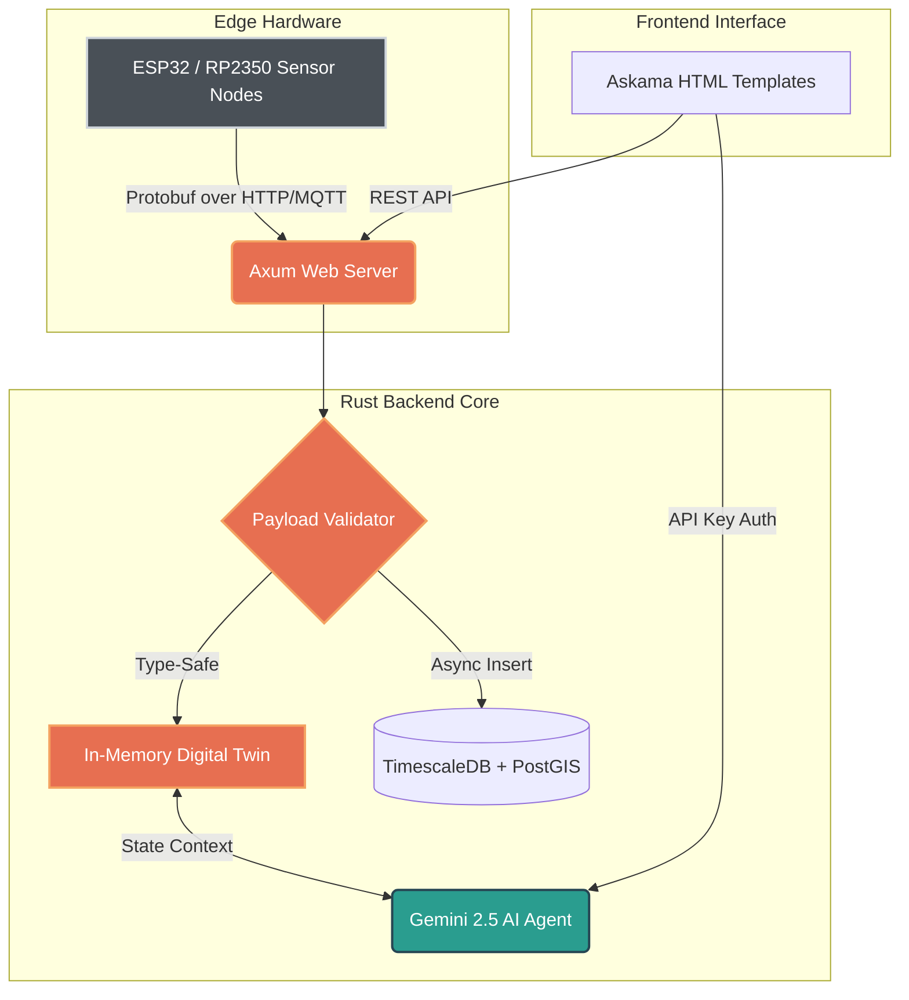

# 🌊 oscar-bio-dev & Telemetry Hub 🛰️

> **Hi, I'm Oscar Mora 👋**  
> *Conservation Technologist | Embedded Systems Engineer | Founder of SetaeSense*
>
> I bridge the gap between biological complexity and bare-metal hardware, translating deep ecological requirements into ultra-low-power IoT sensors and Edge AI solutions for environmental monitoring. Based in Pueblo West, Colorado, I focus on building robust, resilient instrumentation that survives extreme field conditions.

---

## 🚀 The Telemetry Hub Architecture

This repository is more than a profile; it hosts my live, industrial-grade **Ecological Telemetry Platform**. Built entirely in **Pure Rust**, it is designed to handle high-frequency, binary environmental data (Protobuf) from ESP32/RP2350 edge nodes, persist it in TimescaleDB, and analyze it using an AI Cognitive Digital Twin.

### System Diagram

### Key Features
- **Zero-Cost Binary Pipelines**: Uses `prost` (Protobuf) for ultra-fast, zero-allocation telemetry deserialization.
- **Cognitive Digital Twin**: An in-memory, thread-safe state representation (`Arc<RwLock<HashMap>>`) of all physical nodes.
- **LLM Integration**: Direct API integration with Gemini 2.5 Flash (`reqwest`), giving the system natural language reasoning over real-time hardware data.
- **Agent Terminal UI**: A custom-built, hacker-styled web interface (using the Gruvbox color palette) for querying the AI.
- **Spatial-Temporal Database**: Pre-configured `docker-compose` stack with **PostgreSQL + PostGIS + TimescaleDB**.

---

## 🔭 Current Focus & Other Projects
- 🌍 **SetaeSense:** Designing custom environmental monitoring hardware and telemetry systems for soil and water ecology.
- 🪱 **Ecological Research:** Leading applied earthworm biodiversity and soil taxonomy studies, integrating physical sampling with precision edaphic modeling.
- ⚙️ **Bare-Metal Engineering:** Developing high-performance, statically typed telemetry platforms from scratch using **Pure Rust** and **Embedded C/C++**.
- 🛠️ **Hardware:** Texas Instruments, Microchip Technology, Analog Devices, RP2350, Espressif (ESP32), STMicroelectronics (STM32).

---

## 🛠️ Contributing & Roadmap
We follow strict engineering standards (0 warnings on `clippy`, secure `cargo audit` gates, and Type-Driven Design). 
- 👉 **[Dive into the Engineering Roadmap here](docs/ROADMAP.md)**
- 👉 **[See Contributing Guidelines](CONTRIBUTING.md)**
- 👉 **[Check the Changelog](CHANGELOG.md)**

## 📫 Let's Connect
- **LinkedIn:** [oscar-bio-dev](https://linkedin.com/in/oscar-bio-dev)
- **Email:** oscar_bio_dev@outlook.com
