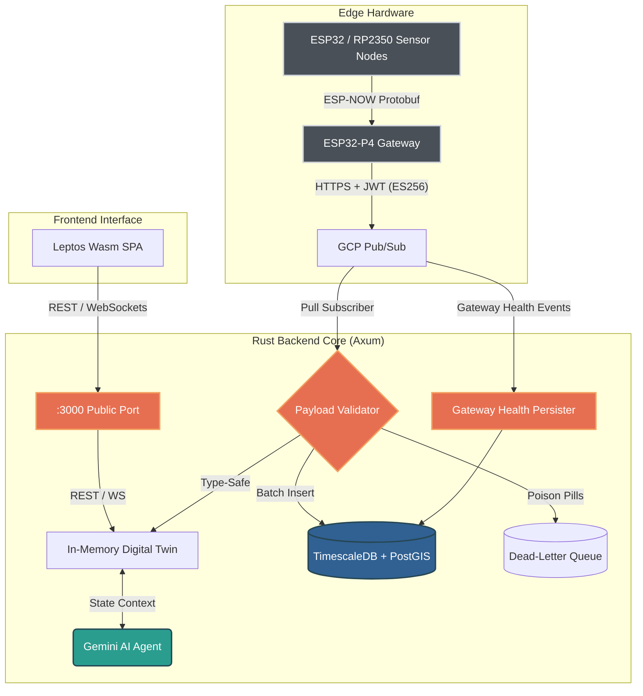

# 🌊 oscar-bio-dev & Telemetry Hub 🛰️

> **Hi, I'm Oscar Mora 👋**  
> *Conservation Technologist | Embedded Systems Engineer | Founder of SetaeSense*
>
> I bridge the gap between biological complexity and bare-metal hardware, translating deep ecological requirements into ultra-low-power IoT sensors and Edge AI solutions for environmental monitoring. Based in Pueblo West, Colorado, I focus on building robust, resilient instrumentation that survives extreme field conditions.

---

## 🚀 The Telemetry Hub Architecture

This repository is more than a profile; it hosts my live, industrial-grade **Ecological Telemetry Platform**. Built entirely in **Pure Rust**, it is designed to handle high-frequency, binary environmental data (Protobuf) from ESP32/RP2350 edge nodes, persist it in TimescaleDB, and analyze it using an AI Cognitive Digital Twin.

### System Diagram

### Key Features

- **Unified Mega-Schema (15 fields)**: A single Protobuf contract shared between edge firmware (C/Nanopb) and backend (Rust/prost), covering environmental, particulate, aquatic, and node diagnostics data.
- **Zero-Cost Binary Pipelines**: Uses `prost` (Protobuf) with hybrid `f32` (wire DTO) → `f64` (domain/DB) architecture for lossless telemetry deserialization.
- **Hardware Security via Cloud**: Uses GCP Pub/Sub with Edge Gateway (JWT/ES256) auth. The backend acts as a completely decoupled consumer service.
- **Resilient Ingestion (DLQ)**: A native Cloud-Native Pull Subscriber handles ingestion asynchronously, persisting poison pills to a Dead-Letter Queue instead of failing or retrying infinitely.
- **Single Public Port**: Port `:3000` serves the public UI, Chatbot, and WebSocket streaming (rate-limited), ensuring no direct edge termination logic bloats the backend.
- **Cognitive Digital Twin**: An in-memory, thread-safe state representation (`Arc<RwLock<LruCache>>`, capped at 10,000 devices) of all physical nodes.
- **Gateway Health Diagnostics**: Dedicated ingestion pipeline via Pub/Sub for edge gateway health events (SD card status, heap monitoring, degradation alerts).
- **EcoTech AI Agent**: Direct integration with Gemini Flash Lite via `system_instruction` schema, with prompt injection protection and real-time reasoning over environmental data.
- **WebAssembly (Wasm) Dashboard**: A custom-built, Gruvbox-styled SPA using **Leptos**, avoiding JS bloat and rendering 12+ sensor metrics per node.
- **Spatial-Temporal Database**: Pre-configured `docker-compose` stack with **PostgreSQL + PostGIS + TimescaleDB**.

### Telemetry Schema

The backend supports the following sensor data from the unified Mega-Schema:

| Category | Fields | Sensors |
|---|---|---|
| Environmental | `temperature`, `humidity`, `pressure`, `gas_resistance`, `iaq` | BME688, SCD41 |
| Particulate | `pm1_0`, `pm2_5`, `pm10_0` | BMV080 |
| Aquatic/Soil | `ph`, `dissolved_oxygen` | Future probes |
| Air Quality | `co2` | SCD41 |
| Node Diagnostics | `battery_mv`, `sleep_cycles` | ESP32 ADC / RTC |

---

## 🔭 Current Focus & Other Projects
- 🌍 **SetaeSense:** Designing custom environmental monitoring hardware and telemetry systems for soil and water ecology.
- 🪱 **Ecological Research:** Leading applied earthworm biodiversity and soil taxonomy studies, integrating physical sampling with precision edaphic modeling.
- ⚙️ **Bare-Metal Engineering:** Developing high-performance, statically typed telemetry platforms from scratch using **Pure Rust** and **Embedded C/C++**.
- 🛠️ **Hardware:** Texas Instruments, Microchip Technology, Analog Devices, RP2350, Espressif (ESP32), STMicroelectronics (STM32).

---

## 🛠️ Contributing & Roadmap
We follow strict engineering standards (0 warnings on `clippy`, secure `cargo audit` gates, and Type-Driven Design).
- 👉 **[Dive into the Engineering Roadmap here](docs/ROADMAP.md)**
- 👉 **[See Contributing Guidelines](CONTRIBUTING.md)**
- 👉 **[Check the Changelog](CHANGELOG.md)**

## 📫 Let's Connect
- **LinkedIn:** [oscar-bio-dev](https://linkedin.com/in/oscar-bio-dev)
- **Email:** oscar_bio_dev@outlook.com
